# The four figures in all three variants

Everything `run_spec_outputs` produces, laid out **figure by figure** so the three variants can be
compared directly. The numbers behind each figure are in the tables here; the argument for the
choices is [`../SPECIFICATION.md`](../SPECIFICATION.md), and the settled numbers are
[`../RESULTS.md`](../RESULTS.md).

## The observer count is not the same in every figure

Changed 2026-08-27. `dg` was run on **13** observers and `da` on **8**, and one of those 8 is not
usable — sub-0395's `da` session used a pilot stimulus whose annuli did not scale spatial period with
eccentricity (`../../AGENTS.md` standing fact 7). So:

| figure | observers | why |
|---|--:|---|
| **Figure 5** (`dg`) | **13** | within-experiment, so it needs no `da` and uses everyone |
| **Figure 6** (`da`) | **7** | the valid `da` sessions |
| **profile figure** | **7** | it puts `dg` and `da` side by side |
| **Figure S5** (hierarchy) | **7** | it plots the *context* effect, `dg − da`, which is paired |
| **every table here** | **7** | context effects are paired within observer |

**`dg` is computed twice, and the second run is not redundant.** The gain rescaling multiplies by a
group gain formed over whichever observers are in the set, so the same observer's `dg` values are a
uniform **6.7% larger** inside the 13-set than inside the matched 7-set. Differencing a 13-based `dg`
against a 7-based `da` would push that factor into the contrast on one side only. Figure 5 uses the
13-observer fit; everything paired uses a separate 7-observer fit. `spec_tables` refuses a mismatched
pair outright rather than trusting the caller.

**Figures 5 and 6 still share one scale.** The axis limits span both observer sets, so the two can
still be compared by eye — which is the whole point of putting them next to each other.

## The three variants, and what each pair isolates

Route and weighting are orthogonal knobs, and the variants deliberately change **one at a time**:

| tag | route | observer weighting | |
|---|---|---|---|
| **`spec`** | harmonic model, continuous θ_V | equal | **primary** — the settled specification |
| `roi` | eight 45° polar-angle wedges | equal | |
| `roipw` | eight 45° polar-angle wedges | precision | |

- **`spec` → `roi` isolates the route.** Same vertices, same gain, same observers, same weighting;
  only whether each vertex enters at its own pRF polar angle or at its wedge centre.
- **`roi` → `roipw` isolates the weighting.** Same route; only whether the eight observers are
  averaged equally or by 1/(τ̂² + σ̂ᵢ²).

There is deliberately no harmonic-plus-precision variant: adding it would leave no pair differing in
exactly one thing.

**The headline, before any of the pictures: no cell changes significance in either comparison.**
Largest movement from the route is 0.033, from the weighting 0.025. The variants are here to show
that the conclusions do not rest on either knob — not because any of them is a live alternative.

**Two structural facts worth holding while you look.** For the Cartesian experiment the
horizontal−vertical and cardinal−oblique regressors do not depend on θ_V at all, so **the route
cannot touch them** — `dg` horiz−vert is −0.467 under `spec` and −0.465 under `roi` by construction,
not by luck. (The two are not bit-identical only because the *weighting* differs at the group stage;
the per-observer values are the same.)
And the second-harmonic panels (B and D) are genuinely about a quarter the size of the
first-harmonic ones; the shared axis makes them look small because they *are* small.

---

## Figure 5 — Cartesian gratings (`dg`), V1 4–8°, **n = 13**

Panels A–D are always the same four asymmetries: **A** horizontal−vertical, **B** cardinal−oblique,
**C** radial−tangential, **D** polar-cardinal−polar-oblique. Row 1 is polar plots — lines are the
fitted model, markers the observed wedge means. Row 2 is each observer's difference with the group
mean and its interval.

Under `spec` the model line is drawn at 0.5°, the markers at 45°. The fit is continuous in θ_V, so
sampling it at the eight marker positions would draw an octagon belonging to the display grid rather
than to the model — and because the second and fourth harmonics have their extrema *between* the
wedge centres, that octagon understated them. The curve passes exactly through the markers, which
`spec_profiles` asserts per observer. `roi` and `roipw` fit no model, so their lines still join the
wedge means and are still eight-sided. Display sampling only: no number in the tables below moved.

All 13 `dg` observers, from `spec_asymmetries_<tag>_v1_4-8_dg13.csv`. These are **not** the numbers
in the paired tables elsewhere in this document, which are the matched 7 — see the note at the top.

| asymmetry | `spec` | `roi` | `roipw` |
|---|--:|--:|--:|
| horiz−vert | −0.467 *p*<.001 | −0.465 *p*<.001 | −0.451 *p*<.001 |
| card−obl | −0.189 *p*=.003 | −0.186 *p*=.003 | −0.176 *p*=.004 |
| rad−tang | +0.106 *p*<.001 | +0.095 *p*<.001 | +0.102 *p*<.001 |
| polc−polo | +0.066 *p*=.001 | +0.035 *p*=.007 | +0.035 *p*=.006 |

**What to look for.** Panels A and B move very little across the three variants — that is the θ_V-free
construction, not a null result. The route does its work in **C and D**, where `spec` reads higher
because the wedge route averages the within-wedge local-orientation variation away. Panel D is where
the route matters most in relative terms: +0.066 against +0.035, nearly a factor of two, though both
are small and both are significant.

**All four asymmetries hold on 13 observers, with smaller *p* than on 7** (updated 2026-08-27). On
the matched 7 the same four read −0.514 *p*<.001, −0.193 *p*=.016, +0.091 *p*=.003, +0.056 *p*=.003.
Six added observers shrink horiz−vert somewhat (−0.514 → −0.467) and leave the rest close, while
every interval tightens. That is the clearest replication evidence in the project: the Cartesian
asymmetries were established on 7 observers and hold on a set nearly twice as large.

**`spec` — the settled specification**
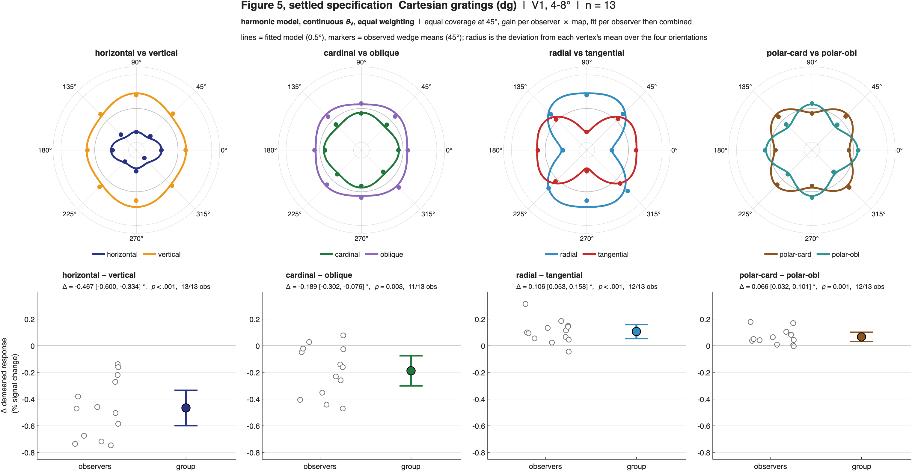

**`roi` — wedge-centre θ_V, equal weighting**
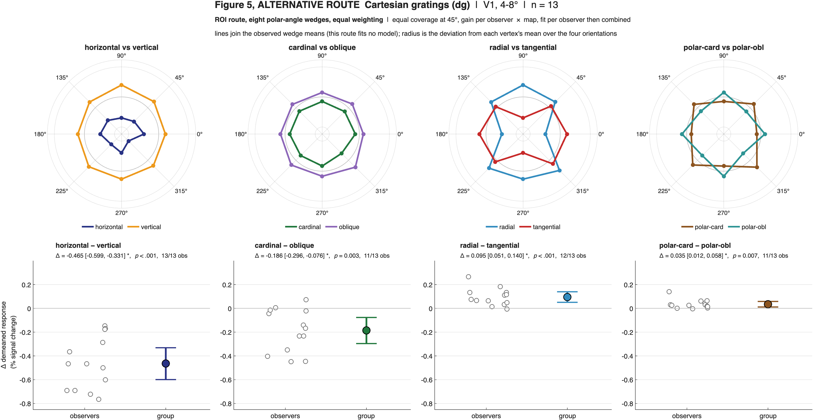

**`roipw` — wedge-centre θ_V, precision weighting**
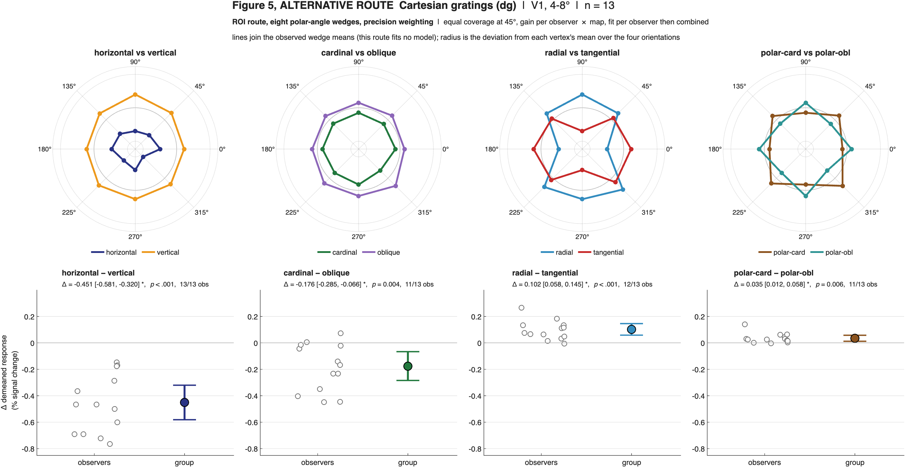

---

## Figure 6 — Polar gratings (`da`), V1 4–8°, **n = 7**

Same panels, same order, same axis limits as Figure 5 — **deliberately**, because `dg`-versus-`da` is
the paper's claim and drawing the two on different scales would undercut the one comparison a reader
most needs to make by eye.

| asymmetry | `spec` | `roi` | `roipw` |
|---|--:|--:|--:|
| horiz−vert | −0.232 *p*=.008 | −0.218 *p*=.010 | −0.214 *p*=.011 |
| card−obl | −0.041 *p*=.105 | −0.028 *p*=.113 | −0.032 *p*=.079 |
| rad−tang | +0.155 *p*=.028 | +0.150 *p*=.041 | +0.175 *p*=.007 |
| polc−polo | +0.033 *p*=.352 | +0.040 *p*=.316 | +0.040 *p*=.299 |

**What to look for.** Here the roles reverse: for polar gratings it is the *polar-frame* regressors
that are θ_V-free, so C and D move least and A and B move with the route. The one cell to watch is
**`da` rad−tang under precision weighting** — 0.150 → 0.175, *p* .041 → .007. That is the largest
single change anywhere in the sweep, and it is the reason precision weighting is reported rather than
adopted: it is the only cell whose *status* the weighting changes, it is marginal by every route, and
it should not be reported as though the weighting settled it
([`../METHOD_DECISIONS.md`](../METHOD_DECISIONS.md) §4).

**`spec` — the settled specification**
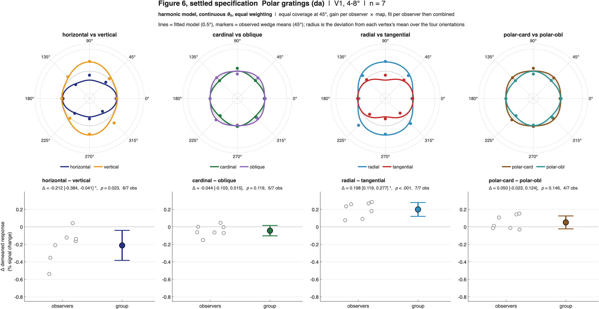

**`roi` — wedge-centre θ_V, equal weighting**
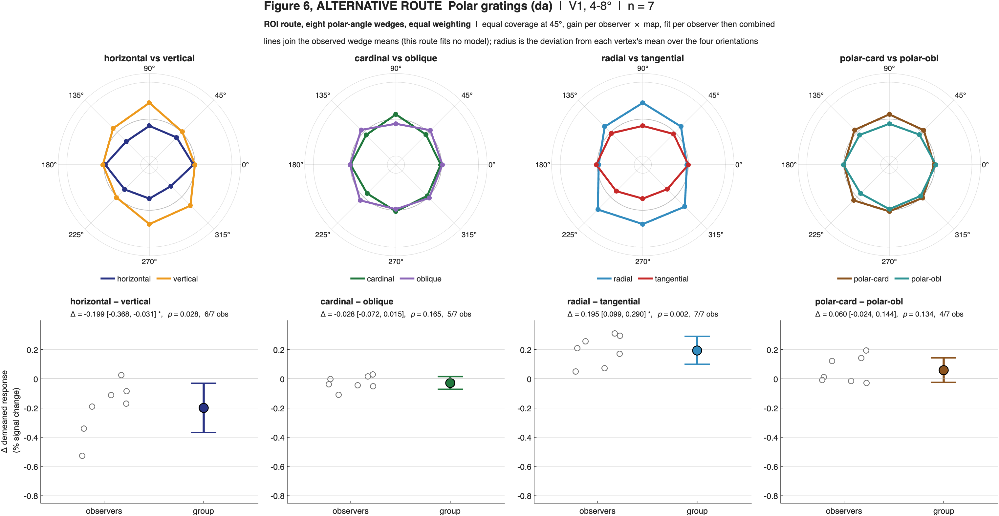

**`roipw` — wedge-centre θ_V, precision weighting**
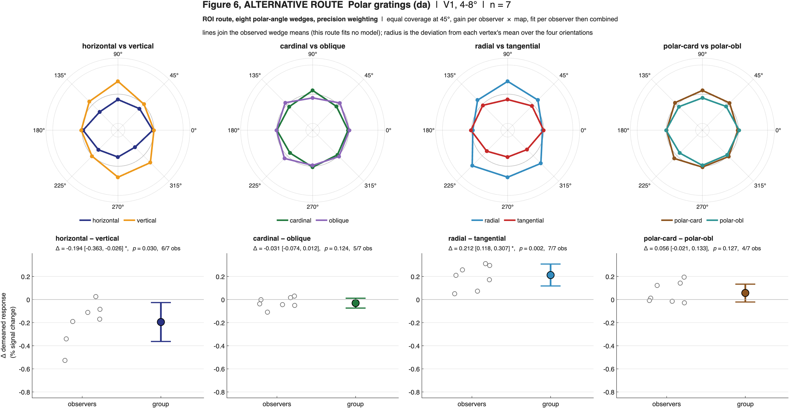

---

## The polar-angle profile, **n = 7**

Drawn on the matched 7, because it puts `dg` and `da` side by side: its two rows are the two
experiments, and a comparison is only meaningful on observers who did both. Its `dg` row therefore
does **not** match Figure 5, which is the 13-observer fit.

The finely-binned version of exactly the panels that permit it, which is why it has **three** columns
rather than four: four orientations at 45° spacing give each vertex's demeaned response exactly three
degrees of freedom, so a profile against continuous θ_V can show three curves and no more. The fourth
coefficient is identified *across* vertices, from the θ_V modulation of the first and third — which
is what the tilt of these curves is.

Same underlying estimates as Figure 6 and as the matched-7 tables. Its `dg` row is the matched-7
`dg`, not the 13-observer `dg` drawn in Figure 5 — the two differ by the group-gain constant as well
as by the six extra observers, so do not read a value off this figure and compare it with Figure 5.

**What to look for — this is the clearest picture of what the route does.** In `spec` the model is a
smooth curve in θ_V. In `roi` **the same curve becomes a step function**, because wedge-centre θ_V
asserts that every vertex within 22.5° of a wedge centre has that centre's polar angle. The step
plot is not a worse drawing of the same thing; it is a picture of what wedge-binning assumes about
polar-angle structure. `roipw` is the same step function with the observers reweighted, so it differs
from `roi` only in the height of the curves, never their shape.

**`spec` — the settled specification**
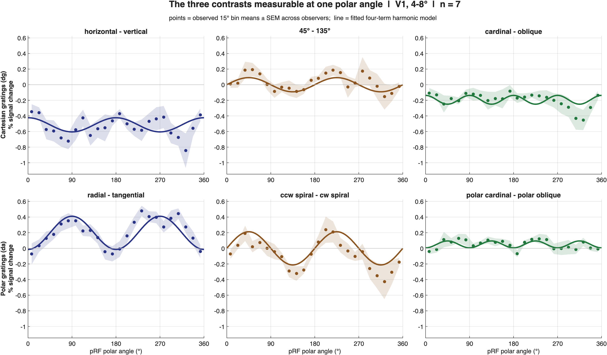

**`roi` — wedge-centre θ_V, equal weighting**
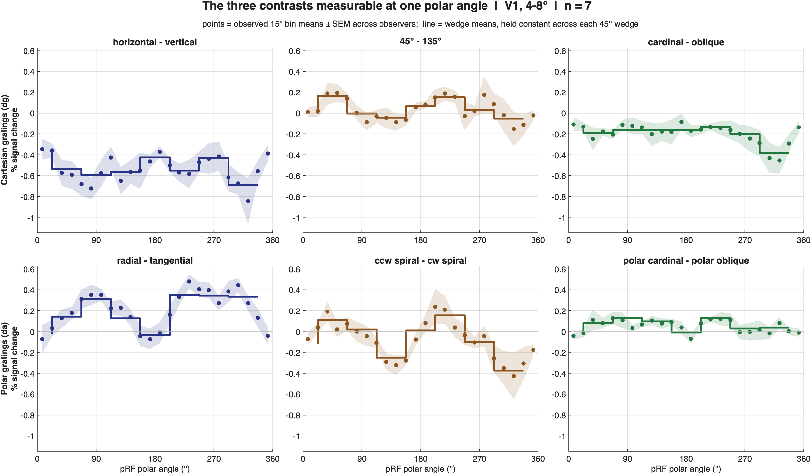

**`roipw` — wedge-centre θ_V, precision weighting**


---

## Figure S5 — across the visual hierarchy, **n = 7**

Top row is each asymmetry in each experiment; bottom row is the context effect (`dg − da`) over the
same maps. Filled markers are V1, V2 and V3 at 4–8°; the open marker is V3a, which qualifies only at
2–10° and so is **not on the same footing**. Maps failing the coverage criterion are absent by
design — their numbers are still in `spec_areas_*.csv` behind the `reportable` flag.

Scales are shared within each row and deliberately not between them: within a row the panels are the
same quantity, across rows they are an asymmetry and a difference of asymmetries.

**Context effects (`dg − da`), the bottom row:**

| asymmetry | variant | V1 | V2 | V3 | V3a (2–10°) |
|---|---|--:|--:|--:|--:|
| horiz−vert | `spec` | −0.316 | −0.260 | −0.102 | −0.084 |
| | `roi` | −0.330 | −0.257 | −0.109 | −0.096 |
| | `roipw` | −0.335 | −0.259 | −0.103 | −0.092 |
| card−obl | `spec` | −0.181 | −0.161 | −0.115 | −0.152 |
| | `roi` | −0.192 | −0.174 | −0.108 | −0.148 |
| | `roipw` | −0.183 | −0.164 | −0.105 | −0.132 |
| rad−tang | `spec` | −0.036 | +0.045 | −0.060 | −0.154 |
| | `roi` | −0.046 | +0.018 | −0.069 | −0.150 |
| | `roipw` | −0.061 | +0.038 | −0.070 | −0.167 |
| polc−polo | `spec` | +0.039 | +0.046 | +0.035 | +0.037 |
| | `roi` | −0.001 | +0.001 | +0.021 | +0.032 |
| | `roipw` | −0.001 | +0.009 | +0.021 | +0.014 |

**What to look for.** The attenuation of the two Cartesian-frame context effects from V1 through V3
is present in all three variants and barely moves between them — that is the robustness claim, drawn
rather than asserted. The one row that visibly depends on the route is **polc−polo**, which sits near
+0.04 under `spec` and near zero under both wedge routes; none of those cells is significant in any
variant, so nothing turns on it, but it is the clearest case of the route mattering.

Note that the *hierarchy trend test* is **always equal-weighted**, whatever variant is requested, so
the `roi` and `roipw` trend tables are byte-identical — asserted in code, not assumed
([`../RESULTS.md`](../RESULTS.md) §5).

**`spec` — the settled specification**
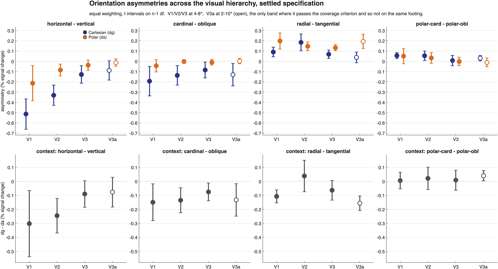

**`roi` — wedge-centre θ_V, equal weighting**
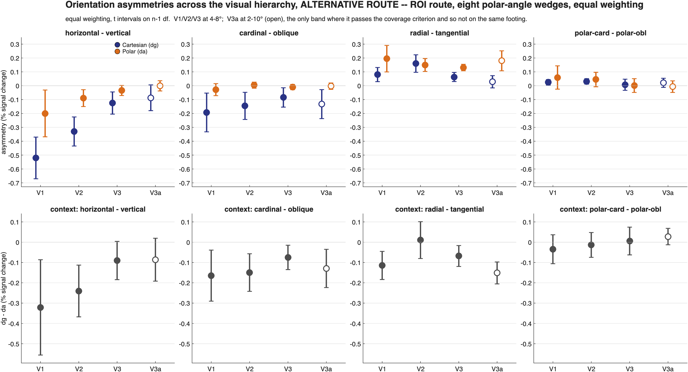

**`roipw` — wedge-centre θ_V, precision weighting**
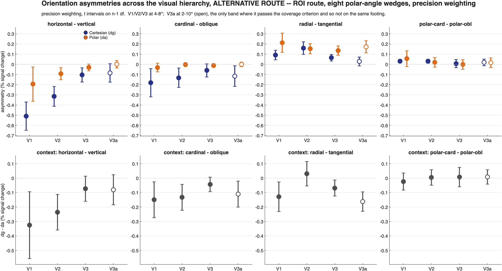

---

## Regenerating all twelve

```bash
matlab -batch "cd('Reproduction/cleanroom'); run_spec_outputs"
```

Five to ten minutes; needs `~/dg_collect/`. Longer than it used to be because `dg` is fitted twice
per variant — once on 13 observers for Figure 5, once on the matched 7 for everything paired. Writes
PNG and PDF of each into `figures/` here, plus every CSV quoted above, including the
`*_dg13.csv` asymmetry tables behind Figure 5. Individual pieces are callable without the full sweep —
`spec_profiles('area','V2')`, `spec_tables('area','V2','variant','roi')`,
`spec_areas_summary('variant','roi')`. → [`../SPECIFICATION.md`](../SPECIFICATION.md) §8.

**This document is written by hand and quotes numbers from those CSVs.** If a figure is regenerated
and a number here disagrees with the CSV, the CSV is right.
