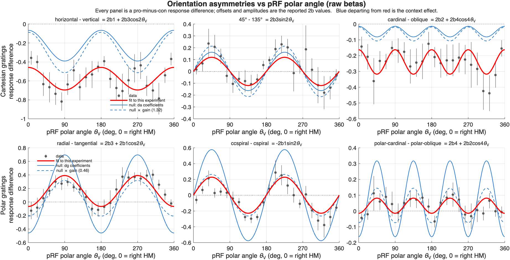
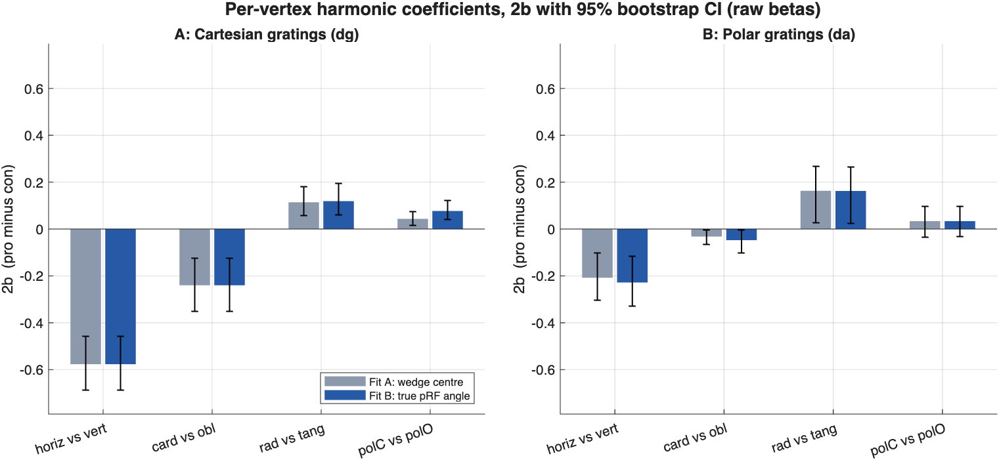
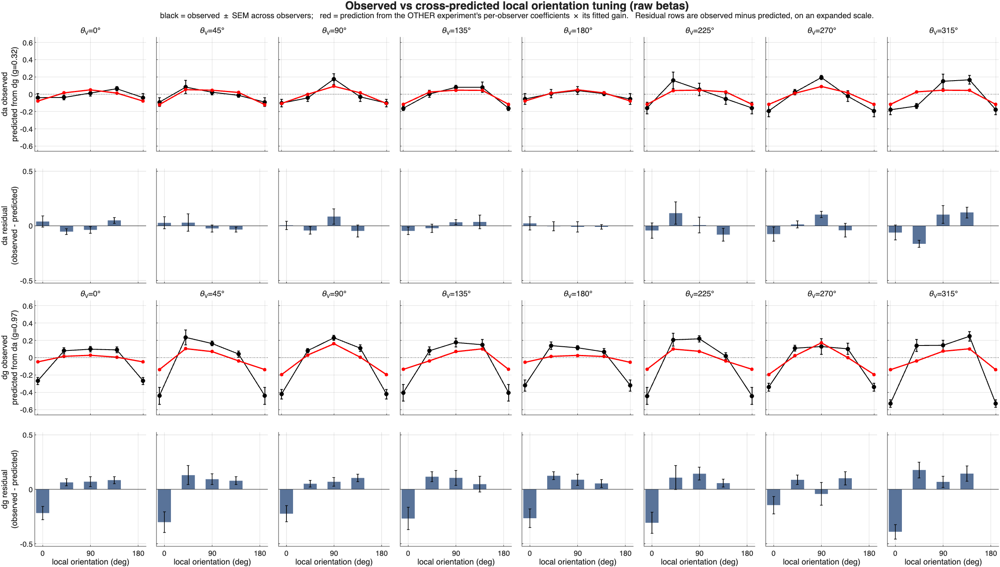
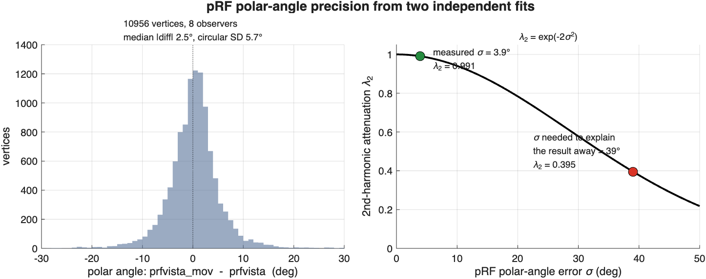

# Supplementary Material — A per-vertex harmonic model of V1 orientation asymmetries

*Separating within-ROI stimulus geometry from global context effects*

---

## S1. Motivation

The analyses in the main text are region-of-interest based. V1 vertices are assigned to one of
eight polar-angle wedges (centred on 0°, 45°, …, 315°, each ±22.5°, restricted to 4–8°
eccentricity and pRF R² > 0.1), and each stimulus is given a single label per wedge: a horizontal
grating counts as "horizontal" when computing the Cartesian asymmetries and as "radial" when
computing the polar ones.

That labelling is exact only for a vertex whose population receptive field lies precisely on the
relevant meridian. Within a 45°-wide wedge, the angle between a stimulus's local orientation and
the vertex's radial axis varies over ±22.5°. The Cartesian and polar stimulus sets are therefore
only *approximately* matched within a wedge, not exactly.

This raises a specific alternative to the paper's central claim. We report that the
horizontal/vertical and cardinal/oblique asymmetries are substantially larger with Cartesian than
with polar gratings, and interpret this as a **context effect** — a dependence of local orientation
tuning on the global structure of the stimulus. But an ROI analysis that mislabels local
orientation could in principle produce the same difference from **geometry alone**, with no context
effect at all.

The model described here was built to distinguish these. It discards the wedge binning entirely and
regresses on each vertex's own pRF polar angle, so that every stimulus's local orientation is
computed exactly for every vertex.

---

## S2. The model

### S2.1 Conventions

All angles are in conventional visual-field degrees: 0° at the right horizontal meridian,
increasing counter-clockwise.

- **θ** — the local orientation of the grating **bars** at a given vertex, modulo 180°. Thus θ = 0°
  is a horizontal grating and θ = 90° a vertical one.
- **θ_V** — the polar angle of the vertex's pRF centre.
- A stimulus is **radial** at a vertex when its bars lie along the radius, i.e. θ = θ_V, and
  **tangential** when θ = θ_V + 90°.

For Cartesian gratings θ is constant across vertices. For polar gratings it rotates with position:
θ = (id + θ_V − 90°) mod 180°, where *id* ∈ {90°, 0°, 135°, 45°} for the pinwheel, annulus,
counter-clockwise spiral and clockwise spiral respectively — that is, each stimulus's local
orientation at the upper vertical meridian.

### S2.2 The four terms

For each vertex *v* we take the four stationary-orientation GLM beta weights, subtract that
vertex's mean across those four conditions, concatenate across vertices, and model the result as a
weighted sum of four harmonic terms:

```
y_vk  =  b1·cos(2θ)  +  b2·cos(4θ)  +  b3·cos(2(θ − θ_V))  +  b4·cos(4(θ − θ_V))
```

| term | asymmetry | positive weight favours |
|---|---|---|
| b1 | horizontal vs. vertical | horizontal |
| b2 | cardinal vs. oblique | cardinal |
| b3 | radial vs. tangential | radial |
| b4 | polar-cardinal vs. polar-oblique | polar-cardinal |

Two properties of the demeaning are worth noting. First, subtracting each vertex's mean removes the
blank condition along with any other component common to the four stimuli, so the model is
unaffected by the fact that the blank is full-field pink noise rather than a true baseline: only
orientation *differences* enter. Second, all four predictors sum to zero across the four conditions
in both experiments, so no intercept is required and the demeaning does not distort the design.

Coefficients are reported throughout as **2·b**, which is the pro-minus-con response difference and
is directly comparable to the difference scores in the main text, in units of percent signal change.
At the eight wedge centres the four predictors reduce exactly to the ±1/0 asymmetry codes used by
the ROI analysis, so the parameters are on the same footing as the linear-mixed-effects weights
reported in the main text.

### S2.3 What the model can and cannot represent

Four orientations spaced 45° apart give each vertex's demeaned response vector exactly **three**
degrees of freedom. Those three are not distributed evenly across harmonics:

```
3 degrees of freedom  =  2 (second harmonic)  +  1 (fourth harmonic)
```

The second-harmonic subspace is two-dimensional; the fourth-harmonic subspace collapses to one
dimension, because at 45° spacing cos(4θ) and sin(4θ) are proportional at the sampled points. Three
consequences follow, and they govern how the results should be read.

**(i) The model is exactly three scalar regressions on θ_V.** Writing the per-vertex amplitudes on
cos(2θ), sin(2θ) and cos(4θ) as *A*, *B* and *C*, the model is algebraically equivalent to

| | Cartesian (absolute frame) | Polar (radial-relative frame) |
|---|---|---|
| A | b1 + b3·cos(2θ_V) | b3 + b1·cos(2θ_V) |
| B | b3·sin(2θ_V) | −b1·sin(2θ_V) |
| C | b2 + b4·cos(4θ_V) | b4 + b2·cos(4θ_V) |

The two experiments are exact mirror images, with the absolute and polar terms exchanging the roles
of offset and modulation. This is the content of **Figure S1**. Note in particular that b1 and b3
are separated *only* by the θ_V modulation of A, together with the independent B channel — which is
precisely the horizontal-versus-radial confound the model exists to adjudicate.

**(ii) b1 and b3 are over-identified, and therefore testable.** b3 appears both as the cosine
modulation of A and as the sine modulation of B. The model forces these two independent estimates
to agree; relaxing that constraint is the specification test of §S5.4.

**(iii) b2 and b4 are the weaker pair.** They occupy a single channel and are separated only by
across-vertex variation in cos(4θ_V). They are estimable, but less precisely than b1 and b3, and
conclusions resting on them should be treated accordingly.

Finally, every term depends on θ_V only through cos(2θ_V), sin(2θ_V) and cos(4θ_V), all of which
have period 180°. **The model is therefore invariant to θ_V → θ_V + 180° and cannot represent
upper/lower or left/right visual-field asymmetries.** Such effects, if present, are averaged rather
than fitted.

---

## S3. Fitting and inference

**Vertices.** The published inclusion criteria, unchanged: V1, 4–8° eccentricity, pRF R² > 0.1.
This yields 11,075 vertices across the eight observers.

**Vertex weighting.** The ROI analysis weights each of the eight wedges equally, which makes the
four asymmetry predictors exactly orthogonal. A naive per-vertex fit does not inherit that: it
weights by cortical vertex density, and V1 over-represents the horizontal meridian. For this design
the correlation between the b1 and b3 columns is analytically the weighted mean of cos(2θ_V), which
at natural density is **+0.35** — a confound imported from cortical magnification, and precisely
between the two parameters the model is meant to separate. We therefore weight vertices for equal
polar-angle coverage (24 bins of 15°, weight 1/count). This restores orthogonality (correlation
+0.016, condition number 2.07, maximum VIF 1.00) while keeping θ_V continuous, so the only remaining
difference from the ROI analysis is the quantity under study.

**Estimation.** Weighted least squares per observer, then averaged, with 95% confidence intervals
from 1,000 bootstrap resamples of the eight observers. Fitting per observer rather than pooling
avoids weighting observers by V1 surface area (vertex counts range from about 3,400 to 8,100).

**Units.** Raw beta weights in percent signal change; no z-scoring. All eight observers are
retained.

---

## S4. Validation against the ROI pipeline

Before interpreting any departure from the ROI analysis, the per-vertex machinery must reproduce it.
With θ_V quantised to the wedge centres, the per-vertex fit recovers the linear-mixed-effects
weights of the ROI route to the printed precision, and the ROI route itself reproduces the published
values exactly (percent signal change):

| | | published route | per-vertex fit, θ_V at wedge centre |
|---|---|---|---|
| **Cartesian** | horizontal − vertical | −0.480 | −0.554 |
| | cardinal − oblique | −0.204 | −0.237 |
| | radial − tangential | 0.116 | 0.109 |
| | polar-cardinal − polar-oblique | 0.029 | 0.042 |
| **Polar** | horizontal − vertical | −0.211 | −0.215 |
| | cardinal − oblique | −0.030 | −0.032 |
| | radial − tangential | 0.150 | 0.151 |
| | polar-cardinal − polar-oblique | 0.034 | 0.040 |

The residual differences are entirely attributable to the published route taking the median within
each wedge while the model is least-squares and therefore mean-based; the four asymmetries are
zero-sum contrasts, so under a linear aggregator the per-vertex demeaning cancels exactly and the
two agree to machine precision.

---

## S5. Results

### S5.1 Within-ROI geometry accounts for 6–8% of the difference

Two fits differing in exactly one respect — the same vertices, the same weighting, only θ_V changes:

- **Fit A** assigns each vertex the polar angle of its wedge centre (the ROI approximation).
- **Fit B** uses each vertex's true pRF polar angle.

Their difference isolates the within-wedge local-orientation artefact, with no confound from
aggregation method or inclusion criteria. Coefficients as 2·b, percent signal change, with 95%
bootstrap intervals (**Figure S2**):

| | Fit A (wedge centre) | Fit B (true pRF angle) |
|---|---|---|
| **Cartesian** horizontal − vertical | −0.577 [−0.687, −0.458] | −0.577 [−0.686, −0.459] |
| cardinal − oblique | −0.240 [−0.352, −0.124] | −0.240 [−0.351, −0.124] |
| radial − tangential | 0.114 [0.057, 0.180] | 0.119 [0.061, 0.194] |
| polar-cardinal − polar-oblique | 0.043 [0.016, 0.074] | 0.077 [0.040, 0.121] |
| **Polar** horizontal − vertical | −0.208 [−0.305, −0.103] | −0.228 [−0.330, −0.117] |
| cardinal − oblique | −0.032 [−0.066, −0.004] | −0.048 [−0.102, −0.004] |
| radial − tangential | 0.163 [0.025, 0.266] | 0.162 [0.025, 0.264] |
| polar-cardinal − polar-oblique | 0.033 [−0.034, 0.097] | 0.034 [−0.033, 0.097] |

The quantity the context claim rests on is the Cartesian-minus-polar gap:

| | Fit A gap | Fit B gap | explained by geometry |
|---|---|---|---|
| horizontal − vertical | −0.369 | −0.349 | **5.6%** |
| cardinal − oblique | −0.208 | −0.192 | **7.6%** |

**Computing each stimulus's local orientation exactly at every vertex shrinks the
Cartesian-versus-polar difference by 6–8%.** It does not approach abolishing it. Two details
reinforce this. First, the correction moves the *polar* experiment's Cartesian-frame asymmetries
slightly further from zero (−0.208 → −0.228), so the wedge approximation was mildly understating
them rather than manufacturing the difference. Second, for the Cartesian experiment the b1 and b2
predictors do not depend on θ_V at all, so their estimates are strictly invariant to the θ_V
specification (Fit B − Fit A = 0.000); the geometry correction acts where it should, on the polar
experiment and on the fourth-harmonic polar term.

### S5.2 Cross-experiment prediction

Fitting one experiment and predicting the other tests the same null from the opposite direction
(**Figure S3**). Variance explained in the held-out experiment, against that experiment's own-fit
ceiling:

| | R² | ceiling |
|---|---|---|
| Cartesian → polar | −0.313 | 0.262 |
| Cartesian → polar, single free gain | 0.140 (gain 0.46) | 0.262 |
| Polar → Cartesian | 0.167 | 0.443 |
| Polar → Cartesian, single free gain | 0.202 (gain 1.32) | 0.443 |

Without a gain, the Cartesian coefficients applied to polar geometry are worse than predicting zero,
because polar responses are roughly half the amplitude. With one free gain the transfer recovers
about half the ceiling in each direction: the shared structure is real but incomplete.

Fitting both experiments jointly at three levels of constraint separates amplitude from reference
frame:

| model | R² |
|---|---|
| (i) shared b1–b4 | 0.300 |
| (ii) shared b1–b4 + one free gain on the polar experiment | 0.352 (gain 0.51) |
| (iii) separate b1–b4 | 0.386 |

Of the gap between shared and separate coefficients, **61% is overall response gain and 39% is a
genuine reference-frame difference**. The (ii) → (iii) step is the context effect proper.

The residual rows of Figure S3 show where the transfer fails. Predicting the Cartesian experiment
from the polar coefficients leaves a large negative residual **at horizontal local orientation in
every one of the eight wedges** — −0.265 [−0.391, −0.150] — while the residual at radial orientation
is indistinguishable from zero. That the deficit sits at horizontal irrespective of polar angle
identifies it as an absolute-orientation failure rather than a geometric one. Its magnitude follows
closely from the coefficient differences: at horizontal, where cos(2θ) = cos(4θ) = 1, the expected
shortfall given the fitted gain is (b1 − g·b1′) + (b2 − g·b2′) = −0.275, against an observed
−0.265.

### S5.3 Which asymmetries are context-dependent

Differences between experiments in each coefficient, as 2·b, raw and after equalising overall
response gain (\* = 95% interval excludes zero):

| | raw | gain-equalised |
|---|---|---|
| horizontal − vertical | −0.349 [−0.523, −0.199] \* | −0.427 [−0.606, −0.252] \* |
| cardinal − oblique | −0.192 [−0.294, −0.084] \* | −0.213 [−0.320, −0.098] \* |
| radial − tangential | −0.043 [−0.161, 0.143] | 0.028 [−0.069, 0.151] |
| polar-cardinal − polar-oblique | 0.044 [−0.034, 0.139] | 0.055 [−0.000, 0.118] |

**The two Cartesian-frame asymmetries are substantially larger in the Cartesian experiment**, after
computing local orientation exactly per vertex and after removing any overall difference in response
magnitude. Gain equalisation *increases* the difference rather than reducing it. This is the
manuscript's central claim, and it survives the test the model was built to impose.

**The two polar-frame asymmetries show no detectable difference between experiments.** Radial −
tangential is 0.119 [0.061, 0.194] for Cartesian gratings and 0.162 [0.025, 0.264] for polar
gratings — both clearly non-zero, with a difference of −0.043 [−0.161, 0.143].

**This absence of evidence should not be read as evidence of absence**, and we state that
explicitly because the temptation to claim a one-sided context effect is strong. Because all eight
observers completed both experiments, every comparison here is within-subject: the per-observer
difference is formed first, then summarised across observers (§S5.5). But three checks show the
polar-frame null is not a result:

- **The interval is wide.** A radial/tangential context effect as large as |0.158| remains
  compatible with these data — which is larger than the cardinal/oblique context effect (−0.175)
  that we *do* report as significant, and 59% of the horizontal/vertical one (−0.268).
- **It rests on one observer.** Six of eight observers show the polar experiment's radial/tangential
  asymmetry exceeding the Cartesian one (sign test *p* = 0.29). Removing sub-0395 — whose polar
  radial/tangential value, −0.244, is the only negative one in the sample — makes the difference
  significant (−0.113 [−0.182, −0.036]). No other leave-one-out does so.
- **The frames are not reliably different from each other.** A within-subject difference of
  differences comparing the magnitude of the Cartesian-frame and polar-frame context effects is not
  significant: horizontal/vertical vs radial/tangential 0.106 [−0.033, 0.275], *p* = 0.26;
  cardinal/oblique vs radial/tangential −0.004, *p* = 0.92.

The defensible statement is therefore the asymmetric one about *evidence*, not about *effects*: the
Cartesian-frame asymmetries show robust context dependence, while for the polar-frame asymmetries
these data are simply uninformative. Distinguishing a genuinely one-sided context effect from a
two-sided one of unequal size would need more observers.

We note separately that the radial/tangential comparison depends on the decision to analyse raw
rather than z-scored beta weights: in the z-scored analysis the difference between experiments does
reach significance. The raw analysis is the one adopted, for reasons independent of this model.

The conclusions are unchanged under a stricter pRF quality threshold (R² > 0.3): horizontal −
vertical −0.367 \*, cardinal − oblique −0.193 \*, radial − tangential −0.036 n.s.

### S5.5 A note on the inferential test

Every context-effect statistic reported above is formed **within observer**: the difference between
experiments is computed for each of the eight observers first, and only then summarised. The
per-vertex harmonic model and the published ROI route agree on the point estimate to three decimals.

We did *not* use a linear mixed-effects model with experiment × asymmetry interactions, and the
reason is worth recording because such a model is the natural thing to reach for. In
`y ~ experiment*(asymmetries) + (1 | observer)` only the intercept varies by observer; every
asymmetry slope and every interaction is a fixed effect assumed identical across observers. The
interaction is then tested against the wedge-level observations rather than against the observers.
In our data that means DF = 502 rather than 7, with no Satterthwaite or Kenward–Roger correction,
and the resulting *p*-values are smaller by roughly 5–25× (horizontal/vertical: *p* = 0.0009 against
the paired *p* = 0.024). Adding random slopes, including for the interaction terms themselves, does
not change this — the denominator DF stays at 502.

Because the 4 × 8 design is balanced and its four asymmetry codes are exactly orthogonal, the LME
fixed effect is *identical* to the mean of the per-observer contrasts (0.268459 either way). The
mixed model therefore adds nothing to the estimate and only misstates its uncertainty. For a
balanced orthogonal within-subject design, the summary-statistic route — per-observer effect, then a
test across observers — is the correct analysis, and it is what we report.

The standard objection to a summary-statistic test is that it treats each observer's effect as
noiseless, so the across-observer variance it uses contains within-observer estimation error as well
as true between-observer variability — which is what a mixed model is normally for. We measured that
error by resampling the *measurement*: GLMsingle retains single-trial betas, and the design is
balanced (8 runs × 52 trials, exactly 4 trials per condition per run), so both a split-half over all
35 balanced run splits and a bootstrap over runs are available. The two agree closely.

Within-observer SE of the context differences is **0.07–0.13**, which is **23–39% of the
across-observer variance** — a substantial minority, but the majority of the spread is genuine
between-observer variation. Disattenuating (removing the measurement variance and re-testing) is the
ceiling on what a mixed model could recover, and it changes no conclusion:

| | *p* observed | *p* disattenuated |
|---|---|---|
| horizontal − vertical | 0.024 | 0.014 |
| cardinal − oblique | 0.006 | 0.0015 |
| radial − tangential | 0.70 | 0.66 |
| polar-cardinal − polar-oblique | 0.93 | 0.92 |

The Cartesian-frame effects tighten somewhat; the polar-frame ones remain null. **The binding
limitation is between-observer variability at n = 8, not measurement noise**, so a mixed model that
recovered the measurement variance perfectly would not alter any inference reported here. The paired
test is valid regardless — only efficiency was ever at stake.

One structural feature is worth noting for anyone designing a similar comparison. The
within-observer SE is roughly three times larger for the asymmetry *matched* to each experiment
(0.121 for horizontal/vertical in the Cartesian experiment, 0.121 for radial/tangential in the polar
one) than for the derived asymmetry (0.042 in each case). A matched contrast uses the same two
stimulus conditions in every wedge, so its measurement noise does not average across wedges, whereas
a derived contrast rotates which stimuli it draws on and averages more effectively.

Finally, sub-0395's discrepant radial/tangential context difference (+0.521 against a group mean of
−0.034) sits **3.5 within-observer SE** from the mean in its own measurement units. It is a genuine
outlier rather than a noisy estimate, though less extreme than a naive reading suggests, and its
polar session has only 6 runs against 8 for the other observers.

### S5.4 Model adequacy

The complete harmonic basis at the second and fourth harmonics adds four sine terms, which should
vanish under left–right visual-field symmetry. They do, with one small exception. For the Cartesian
experiment all three estimable sine coefficients have intervals containing zero (largest 0.016
[−0.024, 0.052]). For the polar experiment the same holds except sin(4θ) = −0.012 [−0.022, −0.003],
an order of magnitude below the core terms — a slight clockwise/counter-clockwise spiral asymmetry
the model does not capture. Core coefficients move by less than 0.002 when the sine terms are
included. The four-term model is adequate.

---

## S6. Control: pRF polar-angle precision

The model's inference depends on θ_V, and the two experiments depend on it through **different**
terms:

| | Cartesian | Polar |
|---|---|---|
| b1, b2 | regressor independent of θ_V → unattenuated | depends on θ_V → attenuated |
| b3, b4 | depends on θ_V → attenuated | regressor independent of θ_V → unattenuated |

Measurement error in θ_V therefore deflates b1 in the polar experiment but not in the Cartesian
one, **inflating the very difference the context claim rests on**. This asymmetry biases toward our
conclusion, and must be bounded rather than assumed away. Forward-simulating a genuinely
context-free world — one shared coefficient set plus polar-angle error σ — reproduces the observed
horizontal/vertical ratio at σ ≈ 39°.

We measured σ rather than assuming it. Every observer's retinotopy was fitted twice and
independently, from two pRF runs with different stimuli. Comparing the two solutions across the
published vertex set (10,956 vertices meeting the criteria in both fits) gives a pooled bias of
+0.19° and a circular standard deviation of 5.70° for the *difference*, hence for a single solution
(**Figure S4**):

```
σ = 3.90°   (robust estimate 2.80°)
λ₂ = exp(−2σ²) = 0.991        λ₄ = exp(−8σ²) = 0.964
```

**Second-harmonic attenuation is under 1%, against the ~39° that would be required.** Three
confirmations: (i) adding the measured error again as fresh jitter moves every coefficient by less
than 0.009; (ii) attenuation-correcting every coefficient leaves the gaps essentially unchanged
(horizontal − vertical −0.349 → −0.347; cardinal − oblique −0.192 → −0.190); (iii) given the measured
σ, the context-free null predicts specific ratios between experiments, and three of four are badly
violated:

| | null predicts | observed |
|---|---|---|
| horizontal − vertical | 0.991 | 0.395 |
| cardinal − oblique | 0.964 | 0.199 |
| radial − tangential | 1.009 | 1.361 |
| polar-cardinal − polar-oblique | 1.038 | 0.435 |

The last row is informative independently of σ. Because b4 is attenuated in the Cartesian experiment
but exact in the polar one, *any* amount of angle error predicts the polar value to exceed the
Cartesian value. The observed ratio is 0.435, in the opposite direction — a pattern no value of σ
can produce.

**Limitations of this control.** The two pRF fits come from the same scanning session and differ in
stimulus rather than session, so their disagreement captures noise- and stimulus-driven error but
not anything shared within a session, such as surface registration or distortion correction. Such
errors would produce a spatially smooth offset in θ_V, biasing rather than attenuating; reaching
σ = 39° would require approximately 38° of purely shared systematic error, which is incompatible
with the 2–3° median agreement between solutions and with the orderly retinotopic organisation of
these maps. Separately, the polar experiment's b4 interval includes zero, so the reversed-sign row
above is suggestive rather than decisive.

---

## S7. Interpretation

Three conclusions follow.

**Local stimulus geometry does not explain the effect.** Replacing the ±22.5° wedge approximation
with each vertex's exact local orientation reduces the Cartesian-versus-polar difference in the
horizontal/vertical and cardinal/oblique asymmetries by 6–8%. The remaining ~93% is not attributable
to imperfect matching of local orientation within the ROIs, and is not attributable to pRF
measurement error, which is an order of magnitude too small.

**Overall response magnitude explains part of it, but not the reference-frame structure.** Polar
gratings elicit roughly half the response amplitude of Cartesian gratings. Of the improvement gained
by letting the two experiments have separate coefficients, 61% is this single scale factor. The
remaining 39% is a genuine difference in the relative weighting of the four asymmetries, and it is
this component the context interpretation requires. Equalising gain makes the Cartesian-frame
differences larger, not smaller.

**Whether the context dependence is confined to the Cartesian frame remains open.** The
radial/tangential asymmetry is clearly non-zero in both experiments and shows no detectable
difference between them, which invites the reading that it is a local property invariant to the
global stimulus. We do not make that claim. The confidence interval on its context effect still
admits a difference larger than the cardinal/oblique context effect we do report; removing one
observer makes it significant; and the Cartesian-frame context effect is not reliably larger than
the polar-frame one (§S5.3). What these data establish is context dependence of the Cartesian-frame
asymmetries, not its absence for the polar-frame ones. Deciding between a genuinely one-sided
context effect and a two-sided one of unequal size will require more observers.

---

## S8. Code and data

All analyses are implemented in `Reproduction/cleanroom/`: `harmonic_predictors.m` (design matrix
and angle conventions), `harmonic_vertex_data.m`, `harmonic_weights.m`, `fit_harmonic_vertex.m`,
`predict_harmonic.m`, `harmonic_decompose.m`, `harmonic_crossexp.m`, `harmonic_roi_roundtrip.m`,
with `run_harmonic_model.m` as the driver and `plot_harmonic.m` generating the figures.
`test_harmonic_model.m` asserts that the four harmonic predictors reduce exactly to the ROI
analysis's asymmetry codes at the eight wedge centres, and verifies the analytic identities and
synthetic recovery; it must pass before results are interpreted. The pRF precision control is
`diagnose_prf_angle_error.m`, with `server_extract/collect_prf_replicate.m` retrieving the second
pRF solution. The within-subject context tests, the leave-one-observer-out and equivalence analyses,
and the mixed-model comparison of §S5.5 are in `diagnose_context_asymmetry.m`. Coefficients for both weighting schemes and both scaling variants are tabulated in
`harmonic_coefficients_raw.csv`. A fuller internal account, including the z-scored sensitivity
analysis, is in `Reproduction/HARMONIC_MODEL.md`.

---

## Figures

### Figure S1 — Orientation asymmetries as a function of pRF polar angle



Each panel plots a pro-minus-con response difference against pRF polar angle, in 15° bins; points
are the mean across the eight observers of each observer's bin mean, error bars are SEM across
observers. Top row, Cartesian gratings; bottom row, polar gratings. Red is the four-term model
fitted to that experiment. Blue is the context-free null — the *other* experiment's coefficients
evaluated through this experiment's geometry — solid without and dashed with the fitted
cross-experiment gain; blue departing from red is the context effect.

The left column shows the same finding twice, in the two forms the mirror structure produces. In the
Cartesian panel the discrepancy is almost purely a vertical offset (the modulation matches, the level
does not); in the polar panel it is almost purely an amplitude (the level matches, the modulation
does not). Both express the fact that b1 differs about 2.5-fold between experiments while b3 does
not. The middle column is a pure estimate of the second-harmonic polar term with no offset — the
model requires it to average to exactly zero across polar angle, which it does.

### Figure S2 — Coefficients with θ_V at the wedge centre versus at the true pRF angle



Coefficients as 2·b with 95% bootstrap intervals over the eight observers. Fit A quantises each
vertex's polar angle to its wedge centre, reproducing the ROI approximation; Fit B uses the true pRF
polar angle. The two are nearly identical, which is the central negative result: exact local
orientation accounts for only 6–8% of the Cartesian-versus-polar difference.

### Figure S3 — Cross-experiment prediction, with residuals



Columns are the eight polar-angle wedges. Rows 1 and 3 show observed responses (black, ±SEM across
observers) against the prediction from the other experiment's coefficients with a single free gain
(red). Rows 2 and 4 show the residuals on an expanded scale. The horizontal axis is local
orientation, 0° = horizontal bars; note that for the polar experiment the mapping from stimulus to
local orientation rotates with polar angle, so that the pinwheel appears at 90° at the upper vertical
meridian and at 0° at the horizontal meridian.

The bottom residual row carries the clearest signal: predicting Cartesian responses from polar
coefficients leaves a large negative residual at horizontal local orientation in every wedge,
identifying an absolute-orientation deficit rather than a geometric one.

### Figure S4 — pRF polar-angle precision



Left: distribution of the difference in estimated polar angle between two independent pRF solutions,
across 10,956 vertices meeting the inclusion criteria in both fits. Right: second-harmonic
attenuation λ₂ = exp(−2σ²) as a function of polar-angle error, with the measured value marked in
green and the value that would be required for measurement error to account for the observed
horizontal/vertical difference marked in red. The measured error attenuates the relevant
coefficients by less than 1%.
